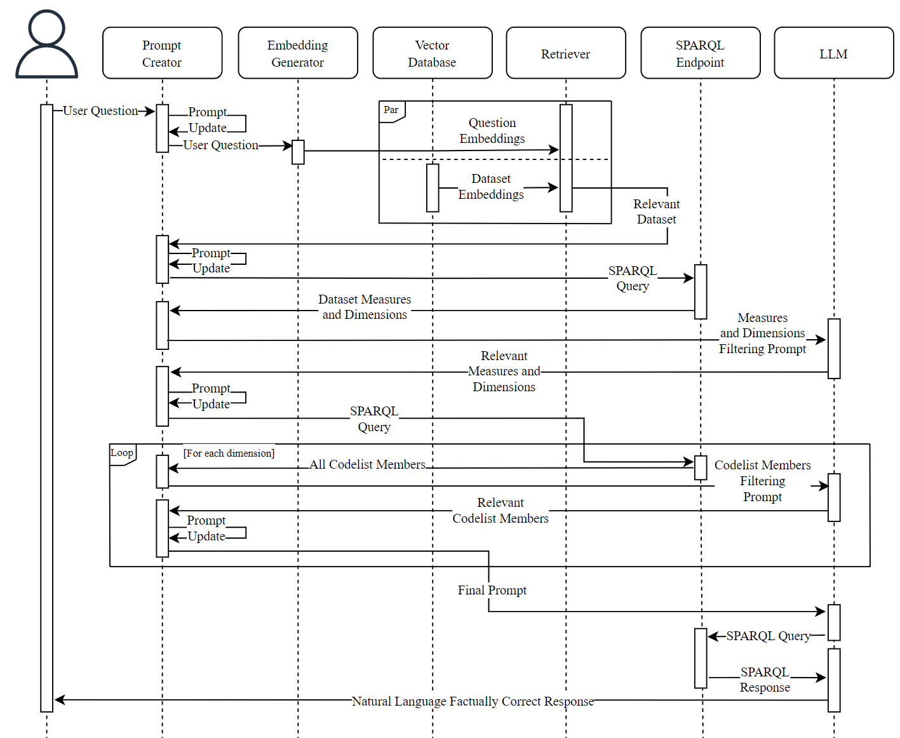

# LLM SPARQL
Official implementation for the proof of concept system presented in the paper "[Can Large Language Models Revolutionalize Open Government Data Portals? A Case of Using ChatGPT in statistics.gov.scot](https://doi.org/10.1145/3635059.3635068)".  

## Overview
The system aims to demonstrate the feasibility of retrieving relevant information from a remote RDF cube-based database by executing meaningful SPARQL queries, through the use of large language models, in response to user questions. The system is tailored to the [open goverment data portal of Scotland](https://statistics.gov.scot/sparql), and all retrievals are conducted through SPARQL queries made to the portal's API endpoint. This version uses OpenAI's `GPT-3.5 Turbo` (checkpoint `0613`) as the LLM, and  `text-embedding-ada-002` as the embeddings model, however, any OpenAI model can be used for either role. ChromaDB serves as the underlying vector store.  

The retrieval process starts with the user's natural language input. The LLM embeds this input and stores it in a ChromaDB, using embedding cosine similarity to select the relevant dataset. The system then iteratively retrieves and filters necessary data from the SPARQL endpoint, such as dataset measures and dimensions, refining the original query along the process. Once the final query is crafted, it is used to retrieve the desired data. The LLM then structures the response and presents it to the user, seamlessly integrating the result into the ongoing conversation.

For a detailed overview of how the components interact, refer to the figure below, illustrating the system architecture:



## Installation
Requires Python 3.9  
Install dependencies:
```
pip install -r requirements.txt
```

## Citation
If you used the code in the main branch of the repository, please consider citing the corresponding paper:

```
@inproceedings{mamalis2023can,
  title={Can large language models revolutionalize open government data portals? a case of using chatgpt in statistics. gov. scot},
  author={Mamalis, Marios Evangelos and Kalampokis, Evangelos and Karamanou, Areti and Brimos, Petros and Tarabanis, Konstantinos},
  booktitle={Proceedings of the 27th Pan-Hellenic Conference on Progress in Computing and Informatics},
  pages={53--59},
  year={2023}
}
```
